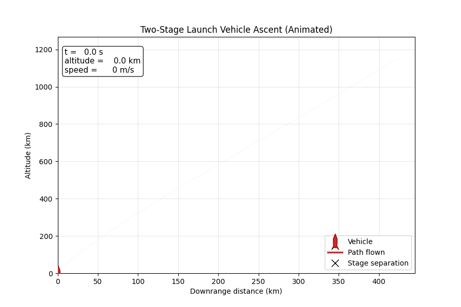
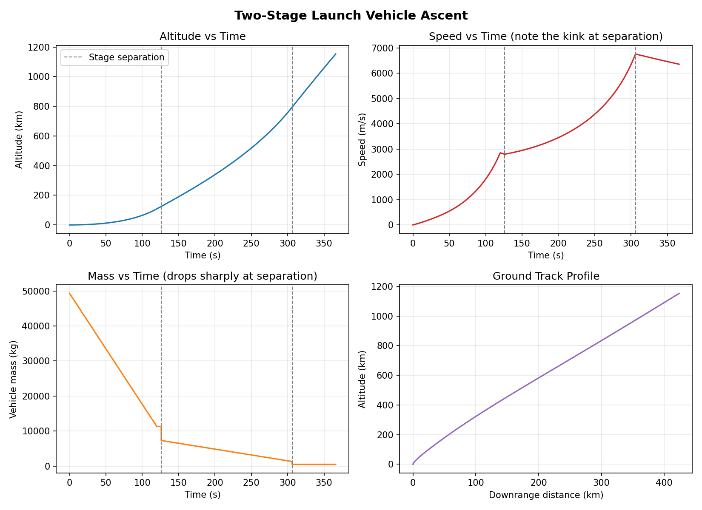
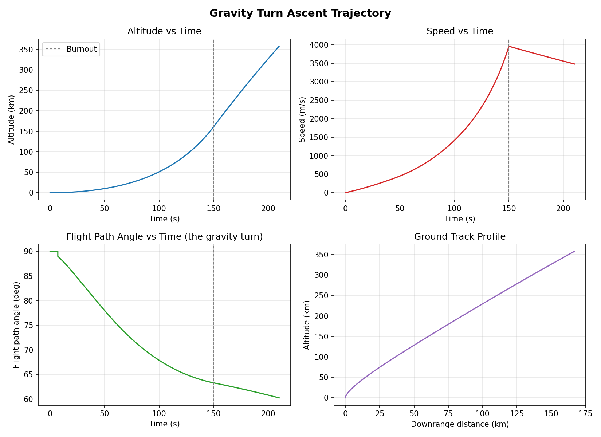

# Rocket Trajectory Simulator

A numerical simulation of a launch vehicle's ascent trajectory — including
the gravity turn maneuver, atmospheric drag, variable mass depletion, and
multi-stage separation — built from first-principles equations of motion
and validated against a textbook closed-form solution. Includes an
interactive web app for configuring and running your own simulations.





## Try it interactively

This project includes a Streamlit web app where you can configure your own
1-3 stage launch vehicle (propellant mass, structural mass, Isp, burn time,
drag) and see the resulting trajectory instantly.

```bash
pip install -r requirements.txt
streamlit run app.py
```

This opens in your browser at `http://localhost:8501`. It can also be
deployed for free on [Streamlit Community Cloud](https://share.streamlit.io)
by pointing it at `app.py` in this repo, giving you a live shareable link.

## Why this project

Most "rocket simulator" scripts online just plot `h = v*t - 0.5*g*t^2` and
call it a day. This one integrates the actual coupled nonlinear ODEs that
govern a real launch vehicle's flight — the same formulation used in
Curtis's *Orbital Mechanics for Engineering Students* (Ch. 11) — and proves
the numerical integrator is correct by matching it against Curtis's own
closed-form analytic solution before adding harder physics on top.

## Features

- **Gravity turn dynamics** — the vehicle pitches over from vertical to
  horizontal under gravity alone, exactly as real satellite launch vehicles
  do to reach orbital velocity
- **Atmospheric drag** — using an exponential (ISA-approximation) density
  model, so drag naturally fades out as the vehicle climbs
- **Variable mass & altitude-dependent gravity** — no constant-mass or
  constant-g shortcuts in the general model
- **Multi-stage separation** — models a real launch vehicle dropping its
  spent booster and igniting an upper stage, with correct mass bookkeeping
  verified against the known payload mass
- **Validated integration** — the numerical solver is checked against
  Curtis's closed-form solution (Example 11.1) to better than 0.1% error

## Results

### Single-stage gravity turn ascent


The flight path angle panel is the key result: it shows the vehicle rising
vertically (90 degrees), then bending over toward horizontal purely under
gravity after a small pitchover kick — the actual mechanism real rockets
use to trade vertical speed for the horizontal speed needed to reach orbit.

### Two-stage launch vehicle
See the trajectory at the top of this README. Note the kink in the speed
curve and the sharp drop in mass at each stage separation — this is why
staging works: dropping dead structural weight lets the remaining engine
accelerate a much smaller mass.

### Validation against Curtis's Example 11.1

| | Analytic (closed-form) | Numerical (this simulator) | Difference |
|---|---:|---:|---:|
| Burnout velocity | 1658.0366 m/s | 1658.0366 m/s | 0.0000% |
| Burnout altitude | 39,590.35 m | 39,590.36 m | 0.0000% |

Run it yourself: `python examples/validate_example_11_1.py`

## Physics model

The simulator integrates the following equations of motion (Curtis, Ch. 11):

- **Speed:** `dv/dt = T/m - D/m - g*sin(gamma)`
- **Flight path angle:** `dgamma/dt = -(1/v)*[g - v^2/(R_E+h)]*cos(gamma)`
- **Downrange distance:** `dx/dt = [R_E/(R_E+h)]*v*cos(gamma)`
- **Altitude:** `dh/dt = v*sin(gamma)`
- **Mass depletion:** `dm/dt = -mdot` (constant during each stage's burn)
- **Thrust:** `T = Isp*g0*mdot`
- **Drag:** `D = 0.5*rho(h)*v^2*A*CD`

where `rho(h)` comes from an exponential atmosphere model and `g(h)` follows
the inverse-square law rather than a fixed constant.

**A numerical subtlety worth noting:** the flight-path-angle equation has a
`1/v` term, which is singular at liftoff when v is near zero. Naively
starting the integration with both a near-zero velocity and an off-vertical
angle causes the solver to blow up. The fix (implemented in
`run_gravity_turn_ascent`) mirrors what real rockets do: rise vertically
first (where `cos(90 deg) = 0` analytically cancels the singularity), then
apply a small deliberate "pitchover kick" once there's enough speed for the
dynamics to behave well.

## Project structure

```
app.py               # interactive Streamlit web UI
rocket_sim/
├── atmosphere.py   # ISA-approximation density model + altitude-dependent gravity
├── vehicle.py      # Rocket class; build_stage_rockets() for multi-stage vehicles
├── dynamics.py      # the coupled equations of motion (Curtis Ch. 11)
└── simulate.py      # solve_ivp wrappers: single-stage, gravity-turn, multi-stage
examples/
├── validate_example_11_1.py  # validates the integrator against a closed-form solution
├── gravity_turn_demo.py       # single-stage gravity turn ascent + plots
└── multistage_demo.py         # two-stage launch vehicle ascent + plots
assets/              # result plots embedded in this README
plots/               # local output folder for generated plots (gitignored)
```

## Setup

```bash
git clone https://github.com/me24s012-cyber/rocket-trajectory-simulator.git
cd rocket-trajectory-simulator
pip install -r requirements.txt
```

## Usage

```bash
# Confirm the numerical integrator matches the textbook closed-form solution
python examples/validate_example_11_1.py

# Single-stage gravity turn ascent with drag
python examples/gravity_turn_demo.py

# Two-stage launch vehicle with stage separation
python examples/multistage_demo.py

# Generate the animated ascent GIF (used in this README)
python examples/animate_ascent.py
```

Each script prints key trajectory milestones to the console and saves a
plot to `plots/`.

## Possible extensions

- Optimal staging (Curtis Ch. 11.6) — solving for the mass split between
  stages that maximizes final payload velocity
- Orbital insertion check — comparing final velocity/flight-path-angle
  against circular orbital velocity at that altitude
- Monte Carlo dispersion analysis on Isp/mass uncertainties

## References

Curtis, H.D. *Orbital Mechanics for Engineering Students*, 3rd/4th ed.,
Chapter 11: Rocket Vehicle Dynamics.

## License

MIT — see [LICENSE](LICENSE).
