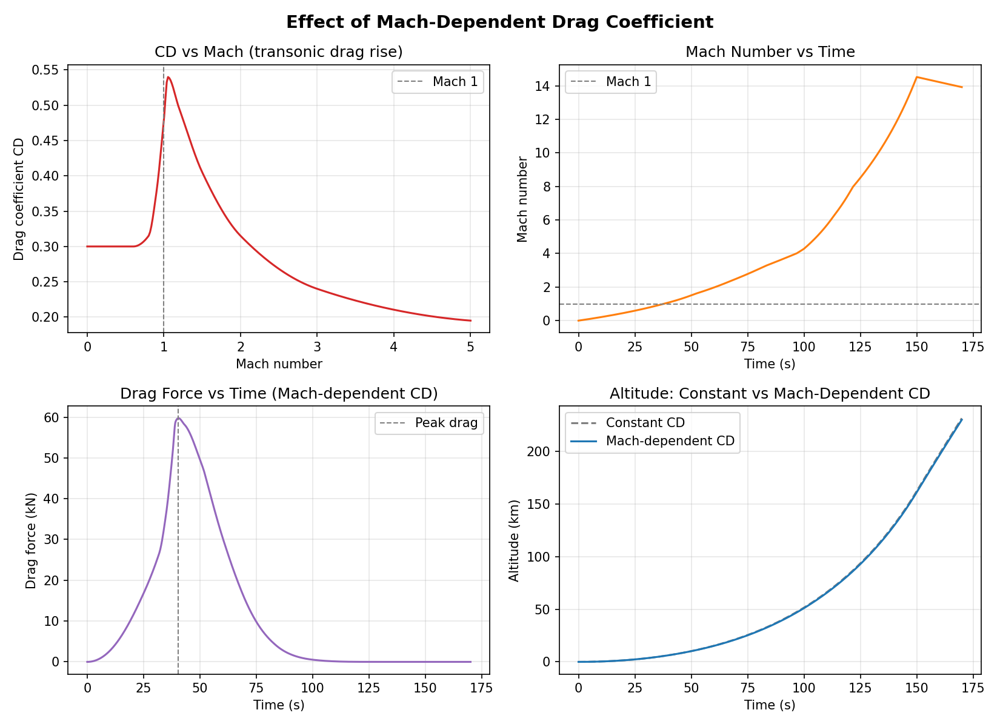
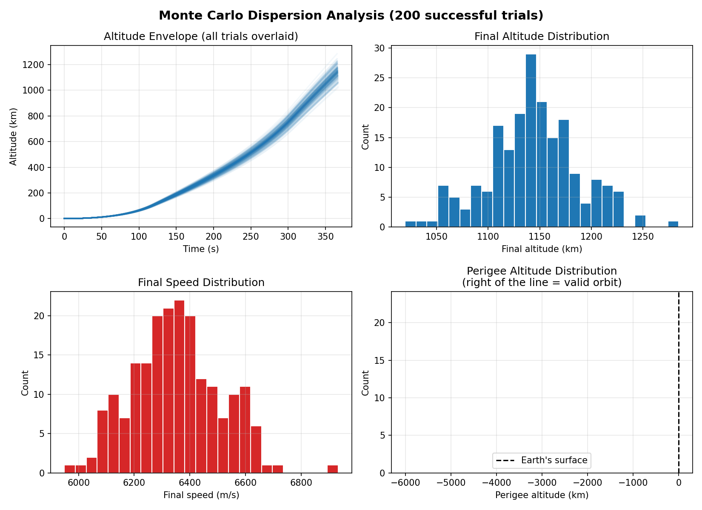

# Rocket Trajectory Simulator

A numerical simulation of a launch vehicle's ascent trajectory — including
the gravity turn maneuver, atmospheric drag, variable mass depletion, and
multi-stage separation — built from first-principles equations of motion
and validated against a textbook closed-form solution. Includes an
interactive web app for configuring and running your own simulations.


## Try it interactively

This project includes a Streamlit web app where you can configure your own
1-3 stage launch vehicle (propellant mass, structural mass, Isp, burn time,
drag) and see the resulting trajectory instantly.

```bash
pip install -r requirements.txt
streamlit run app.py
```

This opens in your browser at `http://localhost:8501`. It can also be
deployed for free on [Streamlit Community Cloud](https://share.streamlit.io)
by pointing it at `app.py` in this repo, giving you a live shareable link.

## Why this project

Most "rocket simulator" scripts online just plot `h = v*t - 0.5*g*t^2` and
call it a day. This one integrates the actual coupled nonlinear ODEs that
govern a real launch vehicle's flight — the same formulation used in
Curtis's *Orbital Mechanics for Engineering Students* (Ch. 11) — and proves
the numerical integrator is correct by matching it against Curtis's own
closed-form analytic solution before adding harder physics on top.

## Features

- **Gravity turn dynamics** — the vehicle pitches over from vertical to
  horizontal under gravity alone, exactly as real satellite launch vehicles
  do to reach orbital velocity
- **Atmospheric drag** — using the full layered International Standard
  Atmosphere (ISA) model (troposphere through mesosphere, with the
  correct temperature lapse rate in each layer), validated against
  published ISA reference tables to 4-5 significant figures
- **Mach-dependent drag coefficient** — CD scales with a representative
  transonic drag-rise curve (peaking near Mach 1.05) instead of staying
  constant, correctly producing a "max-Q" drag peak that occurs well
  before the vehicle's top speed, not at it
- **Variable mass & altitude-dependent gravity** — no constant-mass or
  constant-g shortcuts in the general model
- **Multi-stage separation** — models a real launch vehicle dropping its
  spent booster and igniting an upper stage, with correct mass bookkeeping
  verified against the known payload mass
- **Validated integration** — the numerical solver is checked against
  Curtis's closed-form solution (Example 11.1) to better than 0.1% error
- **Orbital insertion analysis** — treats the vehicle's burnout state as
  the start of a two-body Kepler orbit and reports whether it's actually
  a valid closed orbit, suborbital, or an escape trajectory
- **Optimal staging calculator** — given a target delta-v, payload mass,
  and each stage's Isp/structural ratio, solves for the mass split that
  minimizes total vehicle mass (Curtis Ch. 11.6, Lagrange multiplier
  method), validated against the textbook's own worked example
- **Monte Carlo dispersion analysis** — runs hundreds of trials with
  randomized Isp/mass/drag uncertainty (representing real manufacturing
  tolerances) to show the actual spread of possible outcomes, not just
  one nominal trajectory

## Results

### Single-stage gravity turn ascent


The flight path angle panel is the key result: it shows the vehicle rising
vertically (90 degrees), then bending over toward horizontal purely under
gravity after a small pitchover kick — the actual mechanism real rockets
use to trade vertical speed for the horizontal speed needed to reach orbit.

### Two-stage launch vehicle
See the trajectory at the top of this README. Note the kink in the speed
curve and the sharp drop in mass at each stage separation — this is why
staging works: dropping dead structural weight lets the remaining engine
accelerate a much smaller mass.

### Mach-dependent drag ("max-Q")


Peak aerodynamic drag on this vehicle occurs at Mach 1.09, roughly 40
seconds into flight at 6.4 km altitude — nowhere near the vehicle's top
speed (reached much later, near burnout at ~4 km/s). This is the
real "max-Q" phenomenon well known in launch vehicle design: drag peaks
during the transonic speed range where shock-wave formation spikes the
drag coefficient, not simply where speed is highest.

### Monte Carlo dispersion analysis


Running 200 trials with realistic manufacturing-level uncertainty (Isp
±2%, mass ±3%, drag coefficient ±10%, all 1-sigma) on the two-stage
demo vehicle gives a final altitude of 1143 ± 44 km and final speed of
6352 ± 158 m/s (mean ± std). The probability of achieving a valid orbit
stayed at 0% across every trial — a useful finding in itself: this
vehicle's shortfall (flight path angle too steep at burnout) is
systematic, not something manufacturing tolerances would fix, which is
exactly the kind of insight dispersion analysis is meant to surface.

### Validation against Curtis's Example 11.1

| | Analytic (closed-form) | Numerical (this simulator) | Difference |
|---|---:|---:|---:|
| Burnout velocity | 1658.0366 m/s | 1658.0366 m/s | 0.0000% |
| Burnout altitude | 39,590.35 m | 39,590.36 m | 0.0000% |

Run it yourself: `python examples/validate_example_11_1.py`

### Validation against Curtis's Example 11.5 (optimal staging)

Reproducing the textbook's three-stage optimal staging example (5000 kg
payload, 10 km/s required delta-v) matches every published value —
mass ratios, step masses, structural/propellant masses, and total
vehicle mass — to within ~0.2%.

Run it yourself: `python examples/validate_optimal_staging.py`

### ISA atmosphere model validation

`rocket_sim/atmosphere.py` implements the actual layered ISA model
(temperature lapse rates through the troposphere/tropopause/stratosphere/
mesosphere, with density derived via the ideal gas law) rather than a
single crude exponential approximation. Checked against published ISA
reference table values, it matches to 4-5 significant figures at every
standard layer boundary (e.g., 0.36392 kg/m^3 at 11 km vs. the published
0.3639; 0.08803 kg/m^3 at 20 km vs. the published 0.08803).

Run it yourself: `python rocket_sim/atmosphere.py`

## Physics model

The simulator integrates the following equations of motion (Curtis, Ch. 11):

- **Speed:** `dv/dt = T/m - D/m - g*sin(gamma)`
- **Flight path angle:** `dgamma/dt = -(1/v)*[g - v^2/(R_E+h)]*cos(gamma)`
- **Downrange distance:** `dx/dt = [R_E/(R_E+h)]*v*cos(gamma)`
- **Altitude:** `dh/dt = v*sin(gamma)`
- **Mass depletion:** `dm/dt = -mdot` (constant during each stage's burn)
- **Thrust:** `T = Isp*g0*mdot`
- **Drag:** `D = 0.5*rho(h)*v^2*A*CD`

where `rho(h)` comes from the full layered ISA model and `g(h)` follows
the inverse-square law rather than a fixed constant.

**A numerical subtlety worth noting:** the flight-path-angle equation has a
`1/v` term, which is singular at liftoff when v is near zero. Naively
starting the integration with both a near-zero velocity and an off-vertical
angle causes the solver to blow up. The fix (implemented in
`run_gravity_turn_ascent`) mirrors what real rockets do: rise vertically
first (where `cos(90 deg) = 0` analytically cancels the singularity), then
apply a small deliberate "pitchover kick" once there's enough speed for the
dynamics to behave well.

## Project structure

```
app.py               # interactive Streamlit web UI
rocket_sim/
├── atmosphere.py   # full ISA layered model + altitude-dependent gravity
├── aerodynamics.py # Mach-dependent drag coefficient model
├── vehicle.py      # Rocket class; build_stage_rockets() for multi-stage vehicles
├── dynamics.py      # the coupled equations of motion (Curtis Ch. 11)
├── simulate.py      # solve_ivp wrappers: single-stage, gravity-turn, multi-stage
├── orbit.py         # two-body orbital insertion analysis
├── optimal_staging.py  # Lagrange-multiplier optimal mass staging (Curtis Ch. 11.6)
├── monte_carlo.py   # dispersion analysis over randomized vehicle parameters
└── visualization.py # shared plotting helper (rocket-silhouette marker)
examples/
├── validate_example_11_1.py  # validates the integrator against a closed-form solution
├── gravity_turn_demo.py       # single-stage gravity turn ascent + plots
└── multistage_demo.py         # two-stage launch vehicle ascent + plots
assets/              # result plots embedded in this README
plots/               # local output folder for generated plots (gitignored)
```

## Setup

```bash
git clone https://github.com/me24s012-cyber/rocket-trajectory-simulator.git
cd rocket-trajectory-simulator
pip install -r requirements.txt
```

## Usage

```bash
# Confirm the numerical integrator matches the textbook closed-form solution
python examples/validate_example_11_1.py

# Single-stage gravity turn ascent with drag
python examples/gravity_turn_demo.py

# Two-stage launch vehicle with stage separation
python examples/multistage_demo.py

# Generate the animated ascent GIF (used in this README)
python examples/animate_ascent.py

# Check whether a vehicle actually achieves orbit at burnout
python examples/orbital_insertion_check.py

# Solve for the optimal mass split across stages (validated against
# Curtis's own worked example)
python examples/validate_optimal_staging.py
python examples/optimal_staging_demo.py

# Compare constant-CD vs Mach-dependent CD ("max-Q" behavior)
python examples/mach_drag_demo.py

# Monte Carlo dispersion analysis (takes ~30-60s for 200 trials)
python examples/monte_carlo_demo.py
```

Each script prints key trajectory milestones to the console and saves a
plot to `plots/`.

## Possible extensions

All limitations originally identified for this project have been
addressed (orbital insertion check, optimal staging, full ISA atmosphere,
Mach-dependent drag, and Monte Carlo dispersion analysis). The main
remaining direction is:

- Active/closed-loop guidance — continuously adjusting the thrust vector
  during ascent to reliably hit a precise target orbit, rather than relying
  on a single open-loop pitchover kick. This is a substantially larger
  undertaking (real guidance algorithms, e.g. iterative guidance mode)
  than the incremental additions above.

## References

Curtis, H.D. *Orbital Mechanics for Engineering Students*, 3rd/4th ed.,
Chapter 11: Rocket Vehicle Dynamics.

## License

MIT — see [LICENSE](LICENSE).
